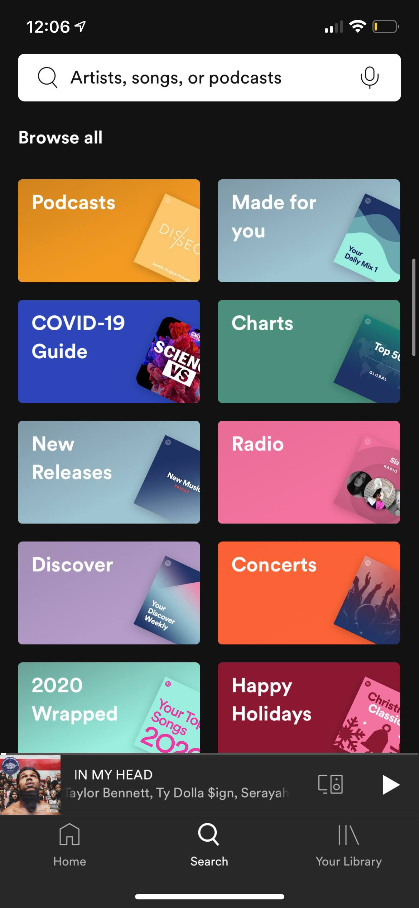

# Content Guide

### Home Page

**Centerpiece**

- 1 story from `centerpiece`

**Top Carousel**

- 2 stories from `app-top-news`
- 1 story from `app-top-opinion`
- 1 story from `app-top-sports`
- 1 story from `app-top-multimedia`
- ordering: news, opinion, sports, multimedia

_IMPORTANT_: If the most recent story from `app-top-opinion` or `app-top-sports` or `app-top-multimedia` is published more than 4 days ago, it will be automatically replaced by an article from `app-top-news`

**In Other xx**

- `app-front-news`
- `app-front-opinion`
- `app-front-sports`
- `app-front-multimedia`

Number of stories in this section is undecided yet

**UTB Carousel**

- 5 stories from `utb-app`(??)

### Discover Page

- A card for each category that links to their most recent stories



---

# Installation Guide

Install [Expo App](https://docs.expo.io/get-started/installation/#2-expo-client-app-for-ios-and) on your mobile.

```
npm install
expo start
```

Once the QR code is generated, open you camera to scan the code. You should be prompted to open Expo.

If you are prompted to install _Expo CLI_ globally, enter Y.

---

# Wireframe

[Link](https://www.figma.com/file/sExr6OlPwSMzWTCVhUXCt3/The-Daily-Pennsylvanian-App?node-id=0%3A1)
