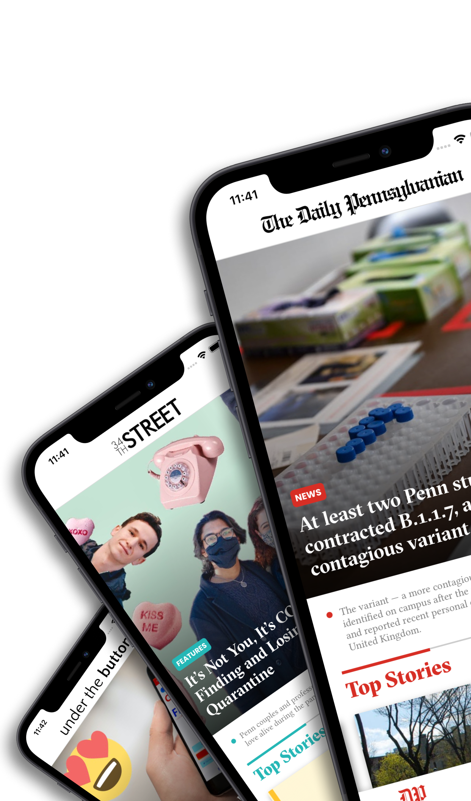
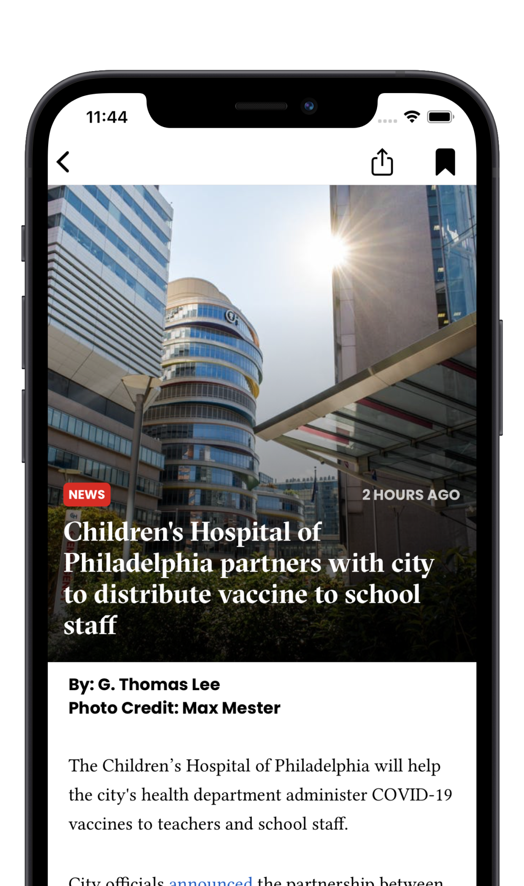
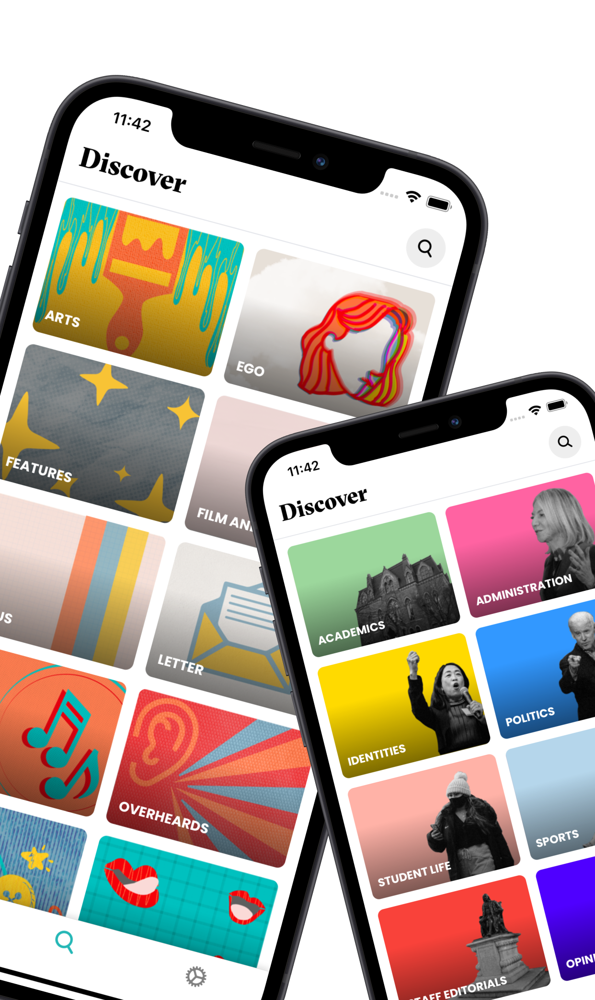
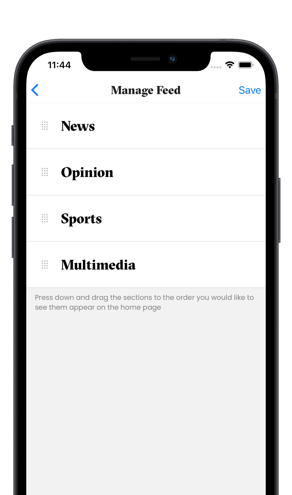
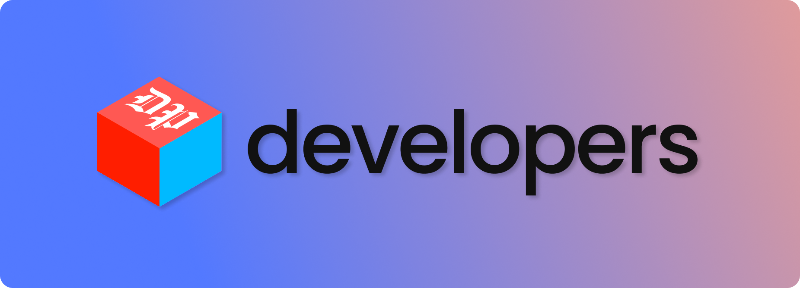

# DP+


The official mobile app for The Daily Pennsylvanian, 34th Street, and Under The Button!

[](https://apps.apple.com/us/app/dp/id1550818171)
[](https://play.google.com/store/apps/details?id=com.thedailypennsylvanian.mobileapp&hl=en&gl=US)

<!-- TABLE OF CONTENTS -->
<details>
  <summary><b>Table of Contents</b></summary>
  <ol>
    <li><a href="#features-">Features</a></li>
    <li><a href="#installation-">Installation</a></li>
    <li><a href="#contributing-">Contributing</a></li>
    <li><a href="#operation-canada-goose-">Operation... Canada Goose?</a></li>
  </ol>
</details>

## Features 📱

- **Top Stories**: View what’s trending in The Daily Pennsylvanian, 34th Street Magazine, and Under The Button.
- **Discover**: Search the articles of each publication and view the most recent articles in certain categories.
- **Bookmarked Articles**: Save articles to read at a later time.
- **Manage Feed**: Change the order in which categories on your home feed change.
- **Notifications**: Keep up to date on breaking news and stories chosen by editors.

   

## Installation 🚀

1. Clone the repo.
   ```sh
   git clone https://github.com/dailypenn/canada-goose.git
   ```
2. Install NPM packages.
   ```sh
   npm install
   ```

> 🔔 **Note: For most purposes, you should use the `development` branch. If you are using the `master` branch, you must set up the iOS app credentials locally:**

3. (**`master` branch only!**) Update `credentials.json` with local iOS credentials
   1. Get distribution certificate from Apple Developer Portal and update path and password.
   ```json
   "distributionCertificate": {
    "path": "ios/certs/<DISTRIBUTION_CERTIFICATE>.p12",
    "password": "<DISTRIBUTION_CERTIFICATE_PASSWORD>"
   }
   ```
   2. Download provisioning profiles from Apple Developer Portal and update paths. The main app target and the OneSignalNotificationServiceExtension require separate provisioning profiles. For `local` and `development` EAS builds, the provisioning profiles should be of type **Ad hoc**. For `production` EAS builds, the provisioning profiles should be of type **App Store**. 
   ```json
   "provisioningProfilePath": "ios/certs/.../<PROVISIONING_PROFILE>.mobileprovision"
   ```
4. If you want to run the app directly on your device, you must first register the device with Expo. Otherwise, feel free to skip this step.
   ```sh
   eas device:create
   ```
5. Build the app. This may take a while, but you don't have to repeat this process unless you change the underlying native code powering the app!
   ```sh
   eas build --profile <profile-name> --platform <platform>
   ```
   1. `<platform>` should be `ios`, `android`, or `all`
   2. `<profile-name>` should be either `development` (to run the app on your device), `local` (to run the app on an iOS simulator), or `production` (to create a production build for submission).
      1. For a `local` build:
         * Download the build once it is completed from the link provided. This will be a .tar.gz file.
         * Extract the file by opening it. You will now have a file like DP.app.
         * Open up your simulator.
         * Drag the file into the simulator.
         * The app will be installed in a few seconds.
6. Start the app.
   ```sh
   expo start --dev-client
   ```
   If you are developing against a physical device, scan the resulting QR code. Otherwise, press the "a" or "i" key to open the app in an Android emulator or iPhone simulator respectively.
   
## Contributing ⭐

[](https://developers.thedp.com)

**In order to contribute, please apply to join our team! Applications open at the beginning of fall and spring semesters [here](https://developers.thedp.com/apply)!**

## Operation Canada Goose ❓

Tasked with migrating content from the harsh winter envrionment of print publication to the temperate oasis of mobile communication, DP Developers faced a challenge like no other: what do we name our objective? It wasn't until we passed the hundredth person with an overpriced winter jacket that we found an animal which so accurately captured the migratory nature of our mission and Penn culture as a whole. And so, equipped with a fitting name, we hatched our plan.

**Operation Canada Goose is here to bring you the best of The Daily Pennyslvanian, straight to your down jacket pockets.**

<!---

## Dynamic Content)

### Daily Pennsylvanian

#### Home Page

**Centerpiece**

- 1 story from `centerpiece`

**Top Carousel**

- 2 stories from `app-top-news`
- 1 story from `app-top-opinion`
- 1 story from `app-top-sports`
- 1 story from `app-top-multimedia`
- ordering: news, opinion, sports, multimedia

_NOTE_: If the most recent story from `app-top-opinion` or `app-top-sports` or `app-top-multimedia` is published more than 4 days ago, it will be automatically replaced by an article from `app-top-news`

**Sections**

- `app-front-news`
- `app-front-opinion`
- `app-front-sports`
- `app-front-multimedia`

3 Stories for each section (user can reorder these sections and show/ hide each section)

_NOTE_: To avoid the same story showing up in both the carousel and the sections below it, just tag an article with either `app-top-xxx` or `app-front-xxx`

#### Discover Page

- A card for each category that links to their most recent stories

### 34th Street

#### Home Page

**Centerpiece**

**Top Carousel**

**Sections**

#### Discover

### Under the Button
-->

---
